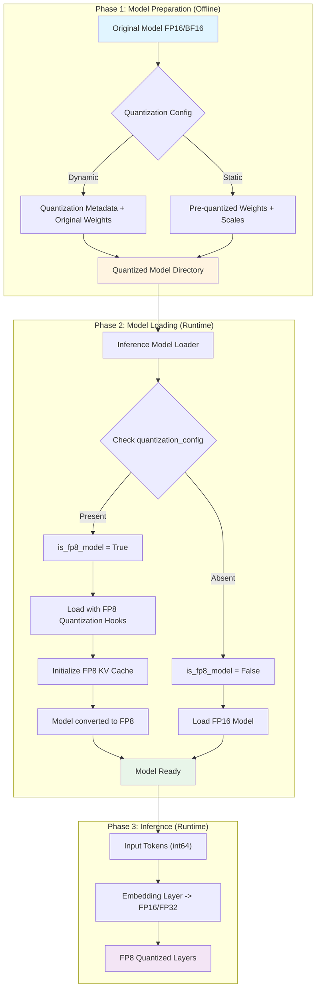
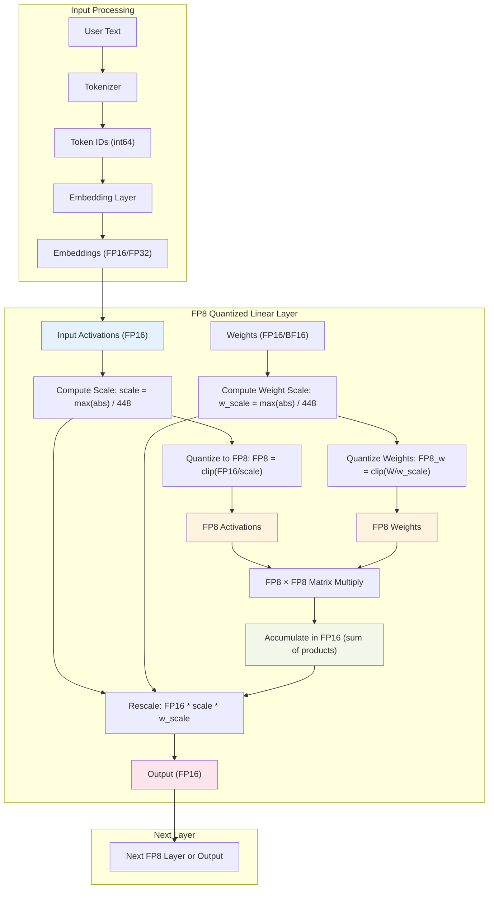

# FP8 Quantization

## Summary
This page describes how torch-spyre support FP8 (8-bit floating point) quantization operations includes FP8 matrix multiplication through PyTorch's `torch._scaled_mm`. FP8 reduces memory usage by 50% compared to FP16 while maintaining acceptable accuracy through quantization and scaling.

**Contents:**

- [What is FP8?](#what-is-fp8)
- [FP8 Quantization](#fp8-quantization-1)
- [FP8 Model: End-to-end Overview](#fp8-model-end-to-end-overview)
- [Torch-Spyre Implementation details](#torch-spyre-implementation-details)
- [Layout propagation](#layout-propagation)
- [Work division](#work-division)
- [Summary](#summary)


---

## What is FP8?

FP8 (8-bit floating point) is a low-precision numeric format that reduces model parameter size and memory bandwidth requirements. PyTorch supports two FP8 formats:

- **E4M3** (1 sign, 4 exponent, 3 mantissa bits): Range ±448, optimized for forward pass
- **E5M2** (1 sign, 5 exponent, 2 mantissa bits): Wider range, optimized for gradients

Torch-spyre currently supports **E4M3** format for conversions and computations.


**Benefits:**
- 50% memory reduction vs FP16 on model parameters
- Reduced memory bandwidth requirements
- Reduces workspace memory for intermediate tensors
- Faster computation on specialized hardware
- Acceptable accuracy with proper scaling

---

## FP8 Quantization

### Quantization formulas

**FP16 → FP8 (Quantization)**

```python
scale = max(abs(tensor)) / 448.0
tensor_fp8 = clip(tensor / scale, -448, 448).to(torch.float8_e4m3fn)
```

**FP8 → FP16 (Dequantization)**

```python
tensor_fp16 = tensor_fp8.to(torch.float16) * scale
```

The scale factor preserves the dynamic range of the original tensor by mapping its maximum absolute value to the FP8 maximum (448).

---

## FP8 Model: End-to-end Overview

### Model conversion phases

FP8 model deployment involves three phases:
1. **Model Preparation** - Prepare the model for FP8 conversion
2. **Load Model and Convert to FP8** - Load and convert model weights
3. **Execute Model with FP8 Computations** - Run inference with FP8 operations




### FP8 quantized layer dataflow

A typical FP8 matmul layer performs the following operations:



**Key points:**
- Scale parameters are stored in FP16
- Matrix multiplication operates on FP8 data
- Accumulation happens in FP16 for numerical stability
- Rescaling is applied after matmul to restore the original scale

---

## Implementation details

### Type mappings

PyTorch FP8 dtypes map to Spyre device formats:

| PyTorch Type | String | Spyre Host Type | Spyre Device Type |
|--------------|--------|-----------------|-------------------|
| `c10::kFloat8_e4m3fn` | `"fp8_143"` | `DataFormats::SEN143_FP8` | `DataFormats::SEN143_FP8` |
| `c10::kFloat8_e5m2fn` | `"fp8_152"` | `DataFormats::SEN152_FP8` | `DataFormats::SEN152_FP8` |

**Note**: The E5M2 format is not yet supported.

### FP8 constants

```python
# FP8 Spyre matmul operation
BATCH_MATMUL_FP8_OP = "batchmatmulfp8"

# FP8 E4M3 numeric limits
FP8_E4M3_MAX = 448.0

# FP8 Spyre operations
SPYRE_FP8_OPS = {
    "batchmatmulfp8",  # FP8 batch matrix multiply
    "qfp8wt",          # Weight FP8 quantization
    "qfp8ch",          # Channel-wise FP8 quantization
    "fp8todl16",       # FP8 to FP16 conversion
}
```

---

### Custom FP8 operations


#### 1. spyre::quantize_fp8_with_scale

Quantizes FP16 activations to FP8 using a pre-computed scale. Performs four steps:

1. **Compute inverse scale**: `inv_scale = 1 / scale` (reciprocal on sfp unit)
2. **Scale the input**: `x_scaled = x * inv_scale` (pointwise)
3. **Clamp to FP8 range**: `x_clamped = clamp(x_scaled, -448, 448)` (pointwise)
4. **Convert to FP8**: `x_fp8 = qfp8ch(x_clamped)` (format conversion)

```python
@torch.library.custom_op("spyre::quantize_fp8_with_scale", 
                         mutates_args=(), device_types="spyre")
def quantize_fp8_with_scale(input: torch.Tensor, scale: torch.Tensor) -> torch.Tensor:
    """
    Args:
        input: FP16 tensor, shape [batch, seq, hidden]
        scale: FP16 scale, shape [batch, seq, 1]
    
    Returns:
        FP8 E4M3 tensor (same shape as input)
    """
    pass
```

**Backend operation**: `qfp8ch` performs channel-wise FP8 format conversion. Input must already be scaled and clamped.

#### 2. spyre::quantize_weight_fp8_with_scale

Similar to activation quantization but uses `qfp8wt` for weight-specific layout:

```python
@torch.library.custom_op("spyre::quantize_weight_fp8_with_scale",
                         mutates_args=(), device_types="spyre")
def quantize_weight_fp8_with_scale(input: torch.Tensor, scale: torch.Tensor) -> torch.Tensor:
    """
    Args:
        input: FP16/BF16 weight tensor
        scale: FP16 scale factor
    
    Returns:
        FP8 E4M3 tensor (same shape as input)
    """
    pass
```

**Backend operation**: `qfp8wt` uses a different packing strategy optimized for weight matrices in matmul operations.

#### 3. spyre::dequantize_fp8_with_scale

Dequantizes FP8 to FP16 using a pre-computed scale. Performs two steps:

1. **Convert FP8 to FP16**: `x_fp16 = fp8todl16(x)` (dtype conversion)
2. **Scale the output**: `x_scaled = x_fp16 * scale` (pointwise)

```python
@torch.library.custom_op("spyre::dequantize_fp8_with_scale",
                         mutates_args=(), device_types="spyre")
def dequantize_fp8_with_scale(input: torch.Tensor, scale: torch.Tensor) -> torch.Tensor:
    """
    Args:
        input: FP8 tensor, shape [batch, seq, hidden]
        scale: FP16 scale, shape [batch, seq, 1]
    
    Returns:
        FP16 tensor (same shape as input)
    
    Note:
        - Requires torch.compile(backend='inductor')
        - Scale must be FP16, not FP32
    """
    pass
```

**Backend operation**: `fp8todl16` converts FP8 to FP16. For every stick of FP8 input, two sticks of FP16 are produced.

---

### torch._scaled_mm - FP8 matmul

The `torch._scaled_mm` operation is lowered to Spyre's `batchmatmulfp8` backend operator:

```python
@register_spyre_lowering(torch.ops.aten._scaled_mm.default)
def lower_scaled_mm(
    mat1,
    mat2,
    scale_a=None,
    scale_b=None,
    bias=None,
    scale_result=None,
    out_dtype=None,
    use_fast_accum=False,
):
```

#### Implementation

**1. Input validation**

Both `mat1` and `mat2` must be FP8 (`torch.float8_e4m3fn`). A `ValueError` is raised otherwise.

**2. Shape support**

Currently supported shapes:
- 2D × 2D: `[M, K] × [K, N] → [M, N]`
- 3D × 2D: `[B, M, K] × [K, N] → [B, M, N]` # TBD
- 3D × 3D: `[B, M, K] × [B, K, N] → [B, M, N]` # TBD

**3. FP8 matmul** (lines 322-331)

Creates a `BATCH_MATMUL_FP8_OP` reduction node:
- Output dtype: FP8 matmul returns FP16 tensor
- Accumulation: FP16 for numerical stability

**4. Post-matmul operations** 

Applied in order:
1. Multiply by activation scale (`scale_a`) if provided
2. Multiply by weight scale (`scale_b`) if provided
3. Add bias if provided

All post-matmul operations are separate pointwise ops.

**5. Unsupported parameters** 

- `scale_result`: Not yet supported (warning logged)
- `use_fast_accum`: Not yet supported (warning logged)
- `out_dtype`: Only FP16 is supported

#### Example usage

```python
import torch

# Quantize inputs to FP8
x_fp8 = torch.ops.spyre.quantize_fp8_with_scale(x, scale_a)
w_fp8 = torch.ops.spyre.quantize_weight_fp8_with_scale(w, scale_b)

# Perform FP8 matmul with post-matmul scaling
result = torch._scaled_mm(
    x_fp8,
    w_fp8,
    scale_a=scale_a,      # Applied after matmul
    scale_b=scale_b,      # Applied after matmul
    bias=bias,            # Optional bias addition
    out_dtype=torch.float16
)
```

**Important**: The `scale_a` and `scale_b` parameters are applied **after** the FP8 matmul, not during quantization.

---

## Layout propagation

Layout propagation handles activation and weight FP8 tensors differently due to their distinct element arrangements strategies.

### Element arrangements

Two element arrangements are defined in `torch_spyre._C`:

**ElementArrangement.QFP8CH** (activation quantization via `qfp8ch`)
- Channel-wise packing: elements from two input sticks packed in the same dimension
- Alternating every 8 elements from input sticks to populate 128 elements in 128-byte stick output stick.
- Optimized for activation tensors

**ElementArrangement.QFP8WT** (weight quantization via `qfp8wt`)
- Weight-specific packing: elements from two input sticks packed in different dimensions
- Alternating after every element to populate 128 elements in a 128-byte stick output stick
- Optimized for 2D stick layout `[2, 64]`

These arrangements ensure correct memory layout for FP8 operations and are propagated through the compilation pipeline to maintain layout consistency.

---

## Work division

FP8 weight tensors use a specialized 2D stick layout:

**Layout specification:**
- **Stick Layout**: `[2, 64]`, both sticks trated as atomic unit with  128-byte
- **Stick size**: Always 128 bytes

**Work division strategy:**
- Work is divided along stick-aligned dimensions
- Ensures efficient memory access and compute utilization

This layout matches hardware memory access patterns for optimal FP8 matmul performance.

---

## Summary
## Completed:
- Custom Operators for FP8 activation quantization, weight quantization and dequantization
- `torch._scaled_mm` support for FP8 2D matmul

## Upcoming 

- Support for 3D × 2D and 3D × 3D FP8 matmul
- FP8 matmul with input tensors contain padding
- `scale` calculation using Spyre operators
- Direct FP8 data transfer to Spyre with proper layout
- Add support for FP8 data operations
